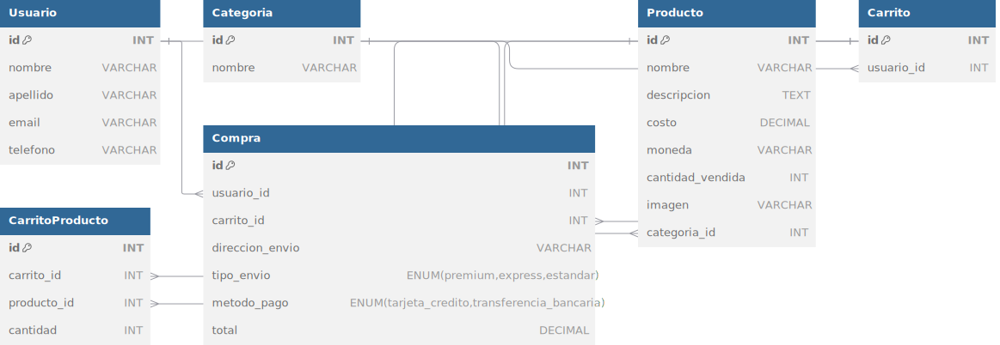

# [Visita mi Web aquí](https://sofiarama.github.io/proyectoFinal/login.html)

## Instructivo paso a paso con todo lo necesario para poder ejecutar el proyecto del backend.
1- Clona el repositorio desde GitHub o descarga el archivo .zip:

git clone <URL_DEL_REPOSITORIO>
2- Navega a la carpeta principal del proyecto. Dentro de esta, accede a la subcarpeta backend:

cd proyectoFinal/backend
3- Instalación de dependencias
Ejecuta el siguiente comando en la terminal desde la carpeta backend:

npm install
4- Ejecución del servidor
Una vez que las dependencias estén instaladas, ejecuta el servidor con el siguiente comando:

node app.js
5- Si todo está configurado correctamente, deberías ver en la terminal un mensaje como este:

Servidor corriendo en http://localhost:3000

LUEGO PROCEDER A HACER PRIMERAMENTE EL REGISTRO EN LA INTERFAZ DEL ECOMMERCE PARA LUEGO HACER EL LOGIN EXITOSO.

## Documentación

- [Manual de la API del e-commerce](docs/Manual%20de%20la%20API%20de%20e_Mercado.pdf)
- [Documentación del Proyecto](docs/Letra%20del%20Proyecto.pdf)
